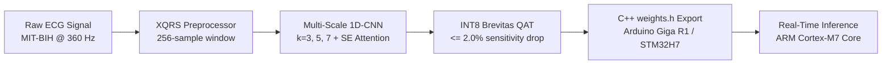

# Embedded Multi-Scale ECG Arrhythmia Classifier & Accelerator

> **Real-time, edge-deployable cardiac arrhythmia detection on Arduino Giga R1 (STM32H747XI MCU) using a Quantization-Aware Multi-Scale 1D-CNN trained on the MIT-BIH Arrhythmia Database.**

[](https://www.python.org/)
[](https://pytorch.org/)
[](https://github.com/Xilinx/brevitas)
[](https://docs.arduino.cc/hardware/giga-r1-wifi/)

---

## 📌 Overview

This repository provides an end-to-end framework for detecting cardiac arrhythmias on low-power microcontrollers and edge hardware. It includes raw signal ingestion from PhysioNet, clinically validated AAMI EC57 multi-hot windowing, training with Focal Loss and Squeeze-and-Excitation (SE) attention, Sensitivity-Preserving INT8 Quantization-Aware Training (SP-QAT), and automated C++ `weights.h` header exports for embedded microcontroller deployment.



### Key Highlights
- **Clinical Standard Compliance**: Strict AAMI EC57 5-class categorization (`Normal`, `Supraventricular`, `Ventricular`, `Bundle_Branch_Block`, `Paced_Other`).
- **Inter-Patient Splitting**: Zero patient overlap between train and test splits (*Chazal et al.*) to prevent synthetic accuracy inflation.
- **Ultra-Lightweight**: Under 50 KB model weight storage in INT8 format, easily fitting inside MCU internal SRAM with no external DRAM required.
- **Multi-Scale Feature Extraction**: Parallel Conv1D branches ($k=3, 5, 7$) with SE channel attention and dual peak/morphology pooling.

---

## 📂 Repository Structure

```
├── documentation/              # Technical specifications, clinical mapping, and docs
│   ├── architecture/           # System and model design documents
│   ├── clinical/               # AAMI EC57 mapping and dataset guides
│   ├── software/               # Training and quantization pipelines
│   ├── hardware/               # Embedded deployment (Arduino Giga R1 / STM32H7)
│   └── resources/              # External references and bibliography
├── firmware/                   # Active MCU deployment (Arduino Giga R1 / STM32H7 firmware)
│   ├── firmware/               # Main .ino sketches, ADC sampler, and inference engine
│   └── tests/                  # Golden vector validation routines
└── software/                   # Core Python ML pipeline
    ├── config/                 # YAML configuration (hyperparameters, splits, mappings)
    ├── data/                   # Raw and processed MIT-BIH dataset directory
    ├── outputs/                # Model checkpoints, evaluation metrics, and export files
    ├── scripts/                # CLI entrypoints (download, train, evaluate, run_qat)
    ├── src/                    # Core Python modules (data, models, training, quantization)
    ├── tests/                  # Pytest test suite
    └── requirements.txt        # Python dependencies
```

---

## 🚀 Quick Start

### 1. Environment Setup

Clone the repository and install dependencies using `uv` (recommended) or `pip`:

```bash
# Using uv (fastest)
uv pip install -r software/requirements.txt

# Or using standard venv + pip
python3 -m venv .venv
source .venv/bin/activate
pip install -r software/requirements.txt
```

### 2. Download Dataset

Fetch the MIT-BIH Arrhythmia Database from PhysioNet:

```bash
python3 software/scripts/download_dataset.py --config software/config/config.yaml
```

### 3. Train Baseline Model (Phase 1)

Train the FP32 Multi-Scale 1D-CNN with inter-patient splitting:

```bash
python3 software/scripts/train.py --config software/config/config.yaml
```

### 4. Evaluate Performance

Evaluate on the unseen inter-patient test set:

```bash
python3 software/scripts/evaluate.py \
  --config software/config/config.yaml \
  --checkpoint software/outputs/checkpoints/best_model.pth
```

### 5. Quantization-Aware Training & Export (Phase 2)

Run INT8 Sensitivity-Preserving QAT and export C++ header (`weights.h`) for the microcontroller:

```bash
python3 software/scripts/run_qat.py \
  --config software/config/config.yaml \
  --baseline software/outputs/checkpoints/best_model.pth
```

### 6. Run Unit Tests

Execute the automated test suite:

```bash
pytest software/tests -q
```

---

## 📖 In-Depth Documentation

For detailed technical explanations, consult the [`documentation/`](documentation/) directory:

- [System Architecture & Dataflow](documentation/architecture/system_overview.md)
- [Multi-Scale 1D-CNN Model Topology](documentation/architecture/model_design.md)
- [AAMI EC57 Clinical Beat Taxonomy](documentation/clinical/aami_ec57_mapping.md)
- [MIT-BIH Preprocessing & Windowing](documentation/clinical/mitbih_dataset.md)
- [Loss Functions & Training Pipeline](documentation/software/training_pipeline.md)
- [INT8 Quantization & Export Pipeline](documentation/software/quantization_and_export.md)
- [MCU Hardware & ADC Sampling](documentation/hardware/embedded_deployment.md)
- [External Academic References](documentation/resources/references.md)

---

## 📄 License

This project is licensed under the MIT License — see [LICENSE](LICENSE) for details.
