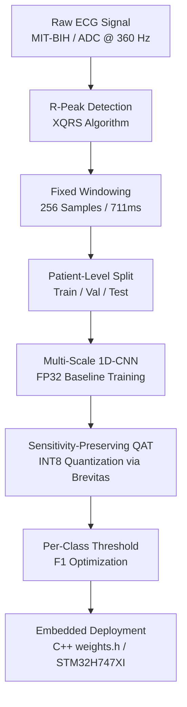

# System Architecture Overview

The system implements an end-to-end, clinically rigorous pipeline for real-time cardiac arrhythmia detection on edge microcontrollers and hardware accelerators.

---

## Key Pipeline Stages

### 1. Data Ingestion & Preprocessing
- **Source**: MIT-BIH Arrhythmia Database (PhysioNet) sampled at 360 Hz.
- **R-Peak Extraction**: Detects ventricular depolarization peaks using the Pan-Tompkins / XQRS algorithm with physiological refractory period filtering (30 to 300 BPM).
- **Segmentation**: Extracts 256-sample windows centered around detected R-peaks (approx. 711 ms of ECG trace: 90 samples pre-R, 166 samples post-R).
- **Multi-Hot Labeling**: Matches peak locations against cardiologist annotations using $O(\log M)$ binary search within a 12-sample tolerance window.

### 2. Deep Learning Classifier
- **Multi-Scale Convolution**: Extracts multi-resolution temporal features using three parallel Conv1D branches (kernel sizes $k=3, 5, 7$).
- **Channel Attention**: Per-branch Squeeze-and-Excitation (SE) blocks dynamically weigh branch importance based on morphology.
- **Dual-Pooling**: Concatenates Adaptive Max-Pooling (peak amplitudes) and Adaptive Average-Pooling (wave morphology) per branch.

### 3. Sensitivity-Preserving Quantization (SP-QAT)
- **Quantization Scheme**: Uniform symmetric INT8 quantization on weights and activations using Brevitas.
- **Clinical Constraint**: Retrains the quantized model to ensure that sensitivity on clinically dangerous minority classes (e.g., Ventricular and Supraventricular arrhythmias) drops by no more than 2.0% relative to the unquantized FP32 baseline.

### 4. Edge Hardware Deployment
- **Target Platform**: Arduino Giga R1 WiFi (STM32H747XI dual-core ARM Cortex-M7 @ 480 MHz).
- **Firmware Pipeline**: Real-time timer-driven ADC sampling @ 360 Hz, local circular buffer windowing, and low-latency integer inference.
- **Memory Footprint**: Total model weight storage is < 50 KB, easily fitting into internal SRAM with zero external DRAM dependencies.
