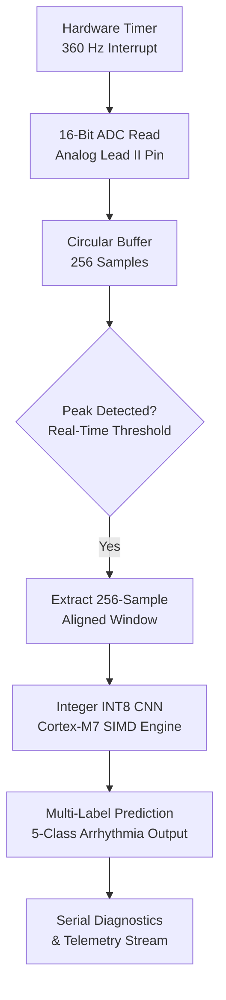

# Embedded Deployment (Arduino Giga R1 / STM32H7)

The primary target platform is the **Arduino Giga R1 WiFi**, powered by the high-performance **STM32H747XI dual-core microcontroller** (ARM Cortex-M7 @ 480 MHz and Cortex-M4 @ 240 MHz).

---

## 1. Embedded System Specifications

| Parameter | Specification |
|---|---|
| Microcontroller | STM32H747XI Dual-Core (Cortex-M7 @ 480 MHz + Cortex-M4 @ 240 MHz) |
| Flash Memory | 2 MB Dual-Bank Flash |
| SRAM | 1 MB internal SRAM (512 KB AXI SRAM + 128 KB ITCM + 128 KB DTCM + 288 KB SRAM1-4) |
| ADC Resolution | 16-bit SAR ADC (configured for ECG acquisition @ 360 Hz) |
| Inference Target Core | Cortex-M7 Core (CMSIS-NN integer SIMD instructions) |
| Latency Budget | < 10 ms per 256-sample window (Sampling interval = 2.77 ms) |
| Model Footprint | ~45 KB Flash (weights) + ~25 KB RAM (working activation buffers) |

---

## 2. Firmware Architecture

### Key Firmware Modules in `hardware_giga/`:
1. `firmware/ecg_sampler.ino`: Configures hardware timers for jitter-free 360 Hz ADC sampling.
2. `firmware/inference_engine.cpp`: Optimized C++ integer convolution and pooling kernels executing against `weights.h`.
3. `firmware/telemetry.cpp`: Streams real-time classified beats over UART/USB for diagnostic monitoring.
