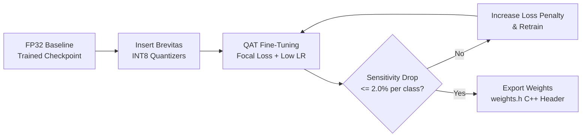

# Quantization-Aware Training & Deployment Export

To deploy deep neural networks to microcontrollers (MCU) without floating-point units (FPUs) or with tight power/memory budgets, weights and activations must be quantized to 8-bit integers (INT8).

---

## 1. Sensitivity-Preserving QAT (SP-QAT)

Quantization introduces precision loss that can degrade sensitivity on rare, life-threatening classes. Our **Sensitivity-Preserving QAT (SP-QAT)** pipeline enforces clinical bounds:



- **Quantization Backend**: [Brevitas](https://github.com/Xilinx/brevitas) (PyTorch library for uniform integer quantization).
- **Bitwidth**: Signed INT8 ($\text{int8} \in [-128, 127]$) for weights and activations.
- **Max Permissible Drop**: Sensitivity for any class must not drop by more than **2.0%** relative to the unquantized FP32 baseline.

---

## 2. Microcontroller Export Formats

Running the export script converts PyTorch weights and scale factors into deployment-ready artifacts:

```bash
python ecg-edge-accelerator/software/scripts/run_qat.py \
  --config ecg-edge-accelerator/software/config/config.yaml \
  --baseline ecg-edge-accelerator/software/outputs/checkpoints/best_model.pth
```

### 1. C++ Header (`weights.h`) for Microcontrollers
Exports flattened, `const int8_t` arrays along with per-layer quantization scale factors for ARM Cortex-M inference:
```cpp
// Auto-generated weights.h
#pragma once
#include <stdint.h>

const int8_t conv1_weights[32 * 1 * 3] = { ... };
const float conv1_scale = 0.015625f;
...
```

### 2. Metadata Manifest (`weights_manifest.json`)
Stores layer shapes, bitwidths, zero-points, and quantization scale factors for validation.
